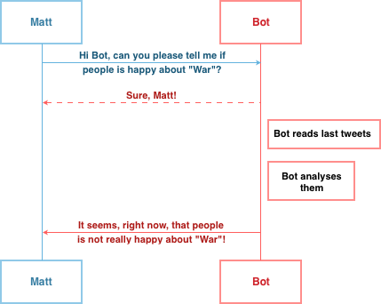

# TelepathyBot
Hi, I am an undergraduate computer engineering student and this is a personal project to introduce myself to python programming.

This project is not intended to be lucrative nor perfect, if you like my work and you do have a Telegram account you can contact *@ruaronicola*. If you don't have one .. What are you waiting for? :)

#### What is TelepathyBot?
TelepathyBot is a simple Telegram Bot with a related Web Application built using **Flask** framework.
Its aim is just to analyse tweets regarding a *user specified* topic in order to estimate the community mood in real-time.

#### How does it work?
The base-idea is really simple:

